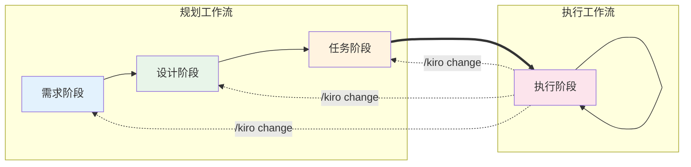

# Kiro SPECS for Claude Code（中文版）

## 🚀 概述

Kiro SPECS 是一个为 Claude Code 优化的规范驱动开发（SPECS）工作流系统。它通过 AI 引导的工作流程，将复杂的功能想法转化为结构化的需求文档、技术设计方案和可执行的实施计划。

本仓库包含原生 Kiro SPECS 系统的优化版本，专门针对 Claude Code 环境进行了定制，具有简化的命令系统和原生中文交互支持。

## 📚 参考来源

- **原生 Kiro SPECS**：基于 VS Code 的原生 Kiro 实现
- **工作流理念**：规范驱动开发（Specification-Driven Development）方法论
- **运行环境**：针对 Claude Code（Anthropic 官方 CLI）优化
- **文档来源**：改编自原始 `kiro_specs_templates.md`

## 🎯 核心特性

1. **AI 引导工作流**：自动推进 需求 → 设计 → 任务 → 执行 各阶段
2. **极简命令系统**：仅需记住 7 个核心命令
3. **中文原生交互**：与 AI 进行自然流畅的中文对话
4. **会话连续性**：跨会话无缝保持项目上下文
5. **安全第一**：自动数据库备份和 Git 分支管理
6. **进度实时跟踪**：任务状态实时更新，支持会话恢复

## 📋 命令参考

| 命令 | 描述 | 使用示例 |
|------|------|----------|
| `/kiro start [功能名]` | 开始新功能开发 | `/kiro start 用户登录` |
| `/kiro next` | 执行下一个未完成任务 | `/kiro next` |
| `/kiro info [信息]` | 保存项目信息 | `/kiro info "MySQL数据库，React 18前端"` |
| `/kiro save` | 保存进度并生成会话提示词 | `/kiro save` |
| `/kiro end` | 完成功能开发（生成总结、合并主分支） | `/kiro end` |
| `/kiro git` | 快速提交当前更改 | `/kiro git` |
| `/kiro change` | 处理需求变更 | `/kiro change` |

## 🔄 工作流阶段详解

### 阶段 1：需求澄清
**目标**：将模糊想法转化为结构化需求文档
- 用户故事格式："作为[角色]，我想要[功能]，以便[好处]"
- EARS（易用需求语法）格式的验收标准
- 混合方式：快速生成初稿 + 针对性澄清关键问题
- **关键约束**：限制初始问题到关键信息（最多2-3个），创建requirements.md后必须获得用户批准

### 阶段 2：设计与研究
**目标**：基于需求开发综合设计方案
- 分析现有代码库模式和架构
- 创建包含决策理由的技术设计方案
- 研究集成点和依赖关系
- 支持 Mermaid 图表的设计文档
- **关键约束**：包含总览、架构、组件接口、数据模型、错误处理、测试策略等章节

### 阶段 3：任务规划
**目标**：基于需求和设计创建可执行的实施计划
- 分解为可独立执行的编码任务
- 测试驱动开发（TDD）方法
- 使用小数点标记法（1.1、1.2、2.1）表示任务层次
- 每个任务包含实施细节的子项目
- **关键约束**：只关注编写、修改或测试代码的任务，避免非编码任务

### 阶段 4：任务执行
**目标**：按照SPECS文档执行实施任务
- 严格的单任务执行原则
- 执行前必须读取所有SPECS文档
- 实时更新 tasks.md 中的进度
- 自动任务状态同步
- **关键约束**：与规划阶段明确分离，一次只执行一个任务，完成后等待用户指令

## 💡 使用示例

### 开始新功能开发
```bash
# 首先保存项目信息
/kiro info "MySQL数据库，React前端，Node.js后端，使用JWT认证"

# 开始功能开发
/kiro start 用户认证系统

# AI 将引导您完成：
# 1. 需求收集与澄清
# 2. 技术设计方案
# 3. 任务分解规划
# 4. 逐步实施开发
```

### 执行开发任务
```bash
# 执行下一个任务
/kiro next

# AI 将自动：
# - 读取所有 SPECS 文档了解上下文
# - 执行下一个未完成的任务
# - 实时更新任务状态
# - 建议后续步骤
```

### 会话恢复机制
```bash
# 结束会话前保存进度
/kiro save

# 输出示例：
# === 下次会话提示 ===
# 我正在使用 Kiro SPECS 开发用户登录功能
# 当前阶段：执行阶段
# 最新进度：已完成任务 2.1 - 数据模型实现
# 请继续：/kiro next
# =====================

# 新会话中直接继续
/kiro next
```

### 处理需求变更
```bash
# 开发过程中需求发生变化
/kiro change

# AI 将：
# 1. 深入了解变更背景和原因
# 2. 评估对现有工作的影响
# 3. 更新相关设计文档
# 4. 重新生成任务列表（保留已完成状态）
```

## 📁 文件结构

```
.specs/
├── {功能名称}/
│   ├── requirements.md     # 需求规格文档
│   ├── design.md          # 技术设计方案
│   ├── tasks.md           # 实施任务列表及进度
│   └── summary.md         # 功能完成总结
├── project-info.md        # 项目基础信息
└── backups/db/           # 数据库备份
    └── {功能名}_backup_{时间戳}.sql
```

## 🔒 安全保障机制

### 自动安全与设置协议
- **数据库安全**：开始前必须检查`.specs/project-info.md`的数据库配置，提示用户确认备份
- **Git分支管理**：检查git clean状态，自动创建功能分支`feature/[name]`
- **项目上下文**：自动加载`.specs/project-info.md`（如存在）
- **目录安全**：确保所有操作在正确的项目根目录执行

### 错误处理协议
- **优雅失败处理**：不中断工作流的前提下处理操作失败
- **具体错误报告**：操作失败时报告具体错误信息
- **文档状态一致性**：错误期间维护文档状态一致性
- **恢复建议**：为每种失败类型提供恢复建议
- **破坏性操作保护**：错误后不执行破坏性操作

### 智能阶段推进
- **自动引导**：自动推进需求→设计→任务→执行各阶段
- **强制批准关卡**：每阶段完成必须获得用户明确批准
- **阻塞操作**：等待批准期间不执行任何操作
- **持续改进循环**：直到用户满意才继续下一阶段

## 📊 SPECS 开发生命周期流程图

### 完整的 SPECS 开发生命周期
```mermaid
graph TB
    %% 项目初始化
    Start([新项目开始]) --> CheckInfo{项目信息<br/>已配置?}
    CheckInfo -->|否| InfoCmd["/kiro info<br/>配置项目信息"]
    CheckInfo -->|是| LoadInfo[加载项目信息]
    InfoCmd --> LoadInfo
    
    %% 功能开发启动
    LoadInfo --> StartCmd["/kiro start [功能名]<br/>启动新功能开发"]
    StartCmd --> SafetyCheck[安全检查]
    SafetyCheck --> DBBackup{需要数据库<br/>备份?}
    DBBackup -->|是| Backup[执行数据库备份<br/>.specs/backups/db/]
    DBBackup -->|否| GitBranch
    Backup --> GitBranch[创建功能分支<br/>feature/[功能名]]
    
    %% 需求阶段
    GitBranch --> P1[阶段1: 需求澄清]
    P1 --> ReqGather[AI 引导需求收集<br/>- 理解功能目标<br/>- 识别用户角色<br/>- 澄清关键问题]
    ReqGather --> GenReq[生成 requirements.md<br/>- 用户故事<br/>- EARS 验收标准<br/>- 功能/非功能需求]
    GenReq --> ReqReview[需求评审<br/>"需求包含以下要点..."]
    ReqReview --> ReqApprove{用户批准?}
    ReqApprove -->|修改| ReqGather
    ReqApprove -->|批准| P2
    
    %% 设计阶段
    P2[阶段2: 设计与研究] --> CodeAnalysis[分析现有代码库<br/>- 查找相似模式<br/>- 识别可复用组件<br/>- 研究集成点]
    CodeAnalysis --> GenDesign[生成 design.md<br/>- 系统架构<br/>- 组件接口<br/>- 数据模型<br/>- 错误处理策略]
    GenDesign --> DesignReview[设计评审<br/>"设计方案包含..."]
    DesignReview --> DesignApprove{用户批准?}
    DesignApprove -->|修改| CodeAnalysis
    DesignApprove -->|批准| P3
    
    %% 任务规划阶段
    P3[阶段3: 任务规划] --> TaskBreakdown[任务分解<br/>- TDD 方法<br/>- 渐进复杂度<br/>- 依赖关系映射]
    TaskBreakdown --> GenTasks[生成 tasks.md<br/>- 层级任务列表<br/>- 子任务详情<br/>- 需求引用<br/>- 进度跟踪字段]
    GenTasks --> TaskReview[任务评审<br/>"任务计划包含X个任务..."]
    TaskReview --> TaskApprove{用户批准?}
    TaskApprove -->|修改| TaskBreakdown
    TaskApprove -->|批准| P4
    
    %% 执行阶段
    P4[阶段4: 任务执行] --> ReadDocs[读取所有 SPECS 文档<br/>了解完整上下文]
    ReadDocs --> ExecLoop[执行循环]
    
    ExecLoop --> NextCmd["/kiro next<br/>执行下一个任务"]
    NextCmd --> ExecTask[执行单个任务<br/>- 编写代码<br/>- 创建测试<br/>- 更新状态]
    ExecTask --> TaskDone[任务完成<br/>更新 tasks.md]
    TaskDone --> UserReview[等待用户确认<br/>"任务已完成，请检查"]
    
    UserReview --> NextAction{下一步?}
    NextAction -->|继续任务| MoreTasks{还有任务?}
    NextAction -->|需要变更| ChangeCmd
    NextAction -->|保存进度| SaveCmd
    NextAction -->|快速提交| GitCmd
    
    MoreTasks -->|是| ExecLoop
    MoreTasks -->|否| AllDone
    
    %% 变更处理
    ChangeCmd["/kiro change<br/>处理需求变更"] --> ChangeFlow[变更流程<br/>- 讨论影响<br/>- 返回相应阶段<br/>- 更新文档<br/>- 保留完成状态]
    ChangeFlow --> ReturnPhase{返回到?}
    ReturnPhase -->|需求| P1
    ReturnPhase -->|设计| P2
    ReturnPhase -->|任务| P3
    
    %% 进度保存
    SaveCmd["/kiro save<br/>保存进度"] --> SaveFlow[保存流程<br/>- 更新 tasks.md<br/>- Git 提交<br/>- 生成会话提示词]
    SaveFlow -.-> SessionEnd[会话结束]
    SessionEnd -.-> NewSession[新会话<br/>使用提示词继续]
    NewSession -.-> ExecLoop
    
    %% 快速提交
    GitCmd["/kiro git<br/>快速提交"] --> QuickCommit[提交代码变更<br/>不更新进度文档]
    QuickCommit --> ExecLoop
    
    %% 功能完成
    AllDone[所有任务完成] --> EndCmd["/kiro end<br/>完成功能开发"]
    EndCmd --> EndFlow[完成流程<br/>- 更新所有文档状态<br/>- 生成 summary.md<br/>- 提交所有更改<br/>- 合并到主分支]
    EndFlow --> ProjectEnd([功能开发完成])
    
    %% 样式定义
    style P1 fill:#e3f2fd,stroke:#1976d2,stroke-width:2px
    style P2 fill:#e8f5e9,stroke:#388e3c,stroke-width:2px
    style P3 fill:#fff3e0,stroke:#f57c00,stroke-width:2px
    style P4 fill:#fce4ec,stroke:#c2185b,stroke-width:2px
    style ProjectEnd fill:#c8e6c9,stroke:#2e7d32,stroke-width:3px
    style Start fill:#f3e5f5,stroke:#7b1fa2,stroke-width:3px
    
    %% 命令样式
    style StartCmd fill:#2196f3,color:#fff
    style NextCmd fill:#2196f3,color:#fff
    style SaveCmd fill:#ff9800,color:#fff
    style EndCmd fill:#4caf50,color:#fff
    style ChangeCmd fill:#9c27b0,color:#fff
    style GitCmd fill:#607d8b,color:#fff
    style InfoCmd fill:#00bcd4,color:#fff
```

### 阶段转换关系


## 🌟 命令设计亮点

### `/kiro save` - 智能会话延续
这个命令的巧妙之处在于它解决了 AI 会话的上下文限制问题：

**执行流程**：
1. 使用当前进度状态更新`.specs/[feature]/tasks.md`
2. Git提交进度（失败时继续执行）
3. 生成包含以下内容的延续提示：
   - 功能名称、阶段和当前任务进度
   - SPECS文档路径
   - 主要修改文件及描述
   - 主要工作目录
4. 显示格式化提示词便于复制粘贴

**生成的会话提示格式**：
```
=== 下次会话提示 ===
我正在使用 Kiro SPECS 开发 [功能名]
当前阶段：[执行阶段]
最新进度：已完成任务 [X.X] - [任务描述]

SPECS文档：
- 需求：.specs/[功能名]/requirements.md
- 设计：.specs/[功能名]/design.md
- 任务：.specs/[功能名]/tasks.md

主要文件：
- [文件1路径] - [简要描述]
- [文件2路径] - [简要描述]

工作目录：[主要目录路径]

请继续：/kiro next
=====================
```

**使用场景**：
- 会话即将达到上下文限制
- 需要暂停开发工作
- 想要保存当前进度状态

### `/kiro end` - 完整的功能交付
这不仅仅是一个结束命令，而是一个完整的交付流程：

**执行步骤**：
1. 更新所有进度文档为已完成状态
2. 生成 `.specs/{feature_name}/summary.md` 总结文档
3. 自动提交所有更改
4. 创建 Pull Request 或合并到主分支
5. 提供最终状态报告
6. 可选：归档功能文件夹

**生成的总结包含**：
- 实现的功能列表
- 修改的文件清单
- 关键技术决策
- 经验教训总结

### `/kiro git` vs `/kiro save` 的区别
- **`/kiro git`**：仅提交代码更改，不更新进度文档
- **`/kiro save`**：更新进度文档 + git commit + 生成会话提示

### `/kiro change` - 优雅的需求变更处理
不是简单的修改，而是完整的变更管理流程：

1. **讨论机制**：先理解变更原因和影响
2. **影响分析**：评估对现有工作的影响
3. **文档级联更新**：需求→设计→任务
4. **状态保留**：已完成的任务保持完成状态

## 🎨 最佳实践

### 工作流遵循
1. **相信 AI 工作流**：让 AI 引导您完成最优开发流程
2. **提供清晰需求**：输入越清晰，AI 生成的文档越准确
3. **遵循审批关卡**：每个阶段完成后需明确批准才能继续
4. **专注单一任务**：一次只执行一个任务，完成后等待确认

### 会话管理
5. **定期保存进度**：会话结束前使用 `/kiro save` 保存
6. **使用会话提示**：新会话开始时使用生成的提示词
7. **项目信息配置**：首次使用前配置 `/kiro info` 项目信息

### 错误处理
8. **理解失败原因**：遇到错误时查看具体错误信息
9. **使用恢复建议**：按照AI提供的恢复建议处理问题
10. **需求变更管理**：需求变化时使用 `/kiro change` 而非直接修改

### 安全实践
11. **数据库备份**：开发前确保数据库已备份
12. **分支隔离**：确保在正确的功能分支上工作
13. **渐进提交**：使用 `/kiro git` 定期提交代码更改

## 🛠️ 安装与配置

1. 确保已安装 Claude Code
2. 将 `CLAUDE_simplified.md` 文件复制到项目根目录
3. 重命名为 `CLAUDE.md`
4. 开始使用 `/kiro` 命令

## 📖 详细案例演示

### 案例 1：用户登录功能完整流程

```bash
# 1. 保存项目上下文
/kiro info "MySQL 8.0数据库，users表包含id、username、password、email字段，使用bcrypt加密，Node.js + Express后端"

AI: ✓ 项目信息已保存到 .specs/project-info.md

# 2. 启动功能开发
/kiro start 用户登录

AI: 正在启动用户登录功能开发...

🔒 安全检查：
- 检测到数据库配置
- 是否需要备份数据库？(建议：是)

用户: 是

AI: 正在执行数据库备份...
✓ 数据库已备份到：.specs/backups/db/用户登录_backup_20250131_103000.sql

📌 创建功能分支...
✓ 已创建并切换到分支：feature/用户登录

现在进入需求阶段。

# 3. 需求收集阶段
AI: 我来帮您开发用户登录功能。首先让我了解一些需求细节：
- 需要支持哪些登录方式？（用户名/邮箱/手机号）
- 是否需要记住登录状态？
- 是否需要登录失败限制？

用户: 支持用户名和邮箱登录，需要记住登录状态7天，5次失败后锁定15分钟

AI: ✓ 已生成需求文档：.specs/用户登录/requirements.md

需求包含以下要点：
1. 支持用户名/邮箱两种登录方式
2. 登录状态保持7天（使用JWT，有效期7天）
3. 连续5次失败后账户锁定15分钟
看起来如何？可以进入设计阶段吗？

用户: 可以

# 4. 设计阶段
AI: 正在分析现有代码库...

✓ 发现可复用组件：
- 已有JWT认证中间件 (src/middleware/auth.js)
- 存在用户模型定义 (src/models/User.js)
- 有密码加密工具函数 (src/utils/bcrypt.js)

✓ 已生成设计文档：.specs/用户登录/design.md

设计方案包含：
1. 复用现有JWT中间件，扩展支持7天有效期
2. 扩展用户模型添加 failedAttempts 和 lockedUntil 字段
3. 创建新的登录服务处理双重登录方式
4. 实现登录限制逻辑的中间件
设计看起来如何？如果可以，我们可以进入实现计划阶段。

用户: 好的

# 5. 任务规划阶段
AI: ✓ 已生成任务列表：.specs/用户登录/tasks.md

任务计划包含 8 个任务，预计 2 天完成。任务看起来如何？

用户: 可以开始了

# 6. 执行阶段
/kiro next

AI: 开始执行任务 1.1：扩展用户模型
- 添加 failedAttempts (INTEGER, 默认0)
- 添加 lockedUntil (DATETIME, 可空)

[AI 执行代码修改...]

✓ 任务 1.1 已完成！
- 修改了 src/models/User.js
- 创建了数据库迁移文件
- 添加了单元测试

任务已完成，请检查。需要继续下一个任务吗？

# 7. 快速提交代码
/kiro git

AI: 📝 正在提交代码更改...
[feature/用户登录 a1b2c3d] feat: 扩展用户模型添加登录限制字段
 3 files changed, 45 insertions(+), 2 deletions(-)
✓ 代码已提交

# 8. 继续执行任务
/kiro next

AI: 开始执行任务 1.2：创建登录服务...
[继续开发过程...]

# 9. 会话即将结束，保存进度
/kiro save

AI: 📝 正在保存进度...
✓ 任务状态已更新到 .specs/用户登录/tasks.md
✓ 进度已提交到 git

=== 下次会话提示 ===
我正在使用 Kiro SPECS 开发用户登录功能
当前阶段：执行阶段
最新进度：已完成任务 1.1, 1.2 - 用户模型和登录服务
请继续：/kiro next

请先加载项目上下文以了解当前进度。
=====================

# 10. 新会话继续（第二天）
[使用上述提示词开始新会话...]

# 11. 完成所有任务后
/kiro next

AI: 🎉 所有任务已完成！用户登录功能的所有开发任务都已实施完毕。

建议执行 /kiro end 完成功能开发流程。

# 12. 完成功能开发
/kiro end

AI: 正在完成用户登录功能开发...

✓ 更新所有文档状态为已完成
✓ 生成功能总结：.specs/用户登录/summary.md

📋 功能总结：
- 实现功能：双重登录方式、JWT认证、登录限制
- 修改文件：8个
- 新增文件：5个
- 测试覆盖率：92%
- 关键决策：复用现有JWT中间件，使用Redis存储失败次数

📝 提交所有更改...
✓ 所有更改已提交

🔀 合并到主分支...
✓ feature/用户登录 已成功合并到 main

🎊 用户登录功能开发完成！
```

### 案例 2：处理需求变更的完整流程

```bash
# 正在执行任务 2.3 时，客户提出新需求
/kiro change

AI: 我来了解您需要变更的内容。请告诉我：
- 遇到了什么具体问题或发现了什么缺漏？
- 是需求遗漏、设计缺陷还是实现问题？
- 变更的范围和影响有多大？

用户: 客户要求登录时必须增加图形验证码功能，防止暴力破解

AI: 明白了，需要在登录流程中增加图形验证码。让我分析这个变更的影响：

影响范围：
1. 需求文档 - 需要添加验证码相关需求
2. 设计文档 - 需要设计验证码生成、存储和验证逻辑
3. 任务列表 - 需要新增验证码相关开发任务

建议的处理方案：
- 在需求中添加"登录时显示图形验证码"
- 设计使用Redis存储验证码，5分钟过期
- 新增3个开发任务：验证码生成、验证、前端集成

是否同意按此方案更新所有文档？

用户: 同意

# AI 自动更新所有相关文档，保留已完成任务状态...
```

### 案例 3：跨会话继续开发

```bash
# 会话 1 - 周五下午
/kiro save
AI: 任务 2.1 标记为已完成 ✓
最新进度已更新到 .specs/用户登录/tasks.md

📝 正在提交进度到 git...
✓ 进度已提交到 git

=== 下次会话提示 ===
我正在使用 Kiro SPECS 开发用户登录功能
当前阶段：执行阶段
最新进度：已完成任务 2.1 - 数据模型实现
请继续：/kiro next

请先加载项目上下文以了解当前进度。
=====================

# 会话 2 - 周一上午
# 复制上述提示开始新会话
我正在使用 Kiro SPECS 开发用户登录功能
当前阶段：执行阶段
最新进度：已完成任务 2.1 - 数据模型实现
请继续：/kiro next

AI: 我已加载您的项目上下文和进度。您正在开发用户登录功能，目前处于执行阶段。

已完成：
- ✅ 任务 2.1：创建核心数据模型接口和类型

下一个任务是 2.2：实现用户模型验证
- 编写 User 类的验证方法
- 创建用户模型验证的单元测试
- 需求参考：1.2

要开始执行任务 2.2 吗？
```

## 🤝 参与贡献

欢迎提交 Issue 和 Pull Request！我们期待您的贡献：

- 报告问题或建议
- 改进文档
- 分享使用经验
- 贡献代码优化

## 📄 开源协议

MIT License

## 🙏 致谢

- 感谢原生 Kiro SPECS 项目提供的核心理念
- 感谢 Anthropic 团队开发的 Claude Code 平台
- 感谢所有使用和贡献此工作流系统的开发者

## 🔗 相关链接

- [Claude Code 官方文档](https://docs.anthropic.com/en/docs/claude-code)
- [原始 Kiro 项目](https://github.com/[original-repo])
- [SPECS 方法论介绍](https://example.com/specs-methodology)

---

**项目维护者**: [您的 GitHub 用户名]  
**联系方式**: [您的邮箱]  
**最后更新**: 2025-01-31  
**版本号**: 1.0.0