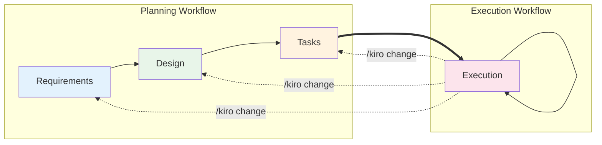

# Kiro SPECS for Claude Code

## 🚀 Overview

Kiro SPECS is a Specification-Driven Development (SPECS) workflow system optimized for Claude Code. It transforms complex feature ideas into structured requirements, technical designs, and executable implementation plans through an AI-guided workflow.

This repository contains an optimized version of the original Kiro SPECS system, specifically tailored for Claude Code's environment with simplified commands and Chinese language interaction support.

## 📚 References

- **Original Kiro SPECS**: Based on the native Kiro implementation for VS Code
- **Workflow Philosophy**: Specification-Driven Development (SPECS) methodology
- **Environment**: Optimized for Claude Code (Anthropic's official CLI)
- **Documentation**: Adapted from original `kiro_specs_templates.md`

## 🎯 Key Features

1. **AI-Guided Workflow**: Automatic progression through Requirements → Design → Tasks → Execution phases
2. **Minimal Commands**: Only 7 essential commands to remember
3. **Chinese Interaction**: Natural Chinese language communication with AI
4. **Session Continuity**: Seamless context preservation across sessions
5. **Safety First**: Automatic database backups and Git branch management
6. **Progress Tracking**: Real-time task status updates and session recovery

## 📋 Commands Reference

| Command | Description | Usage Example |
|---------|-------------|---------------|
| `/kiro start [feature]` | Start new feature development | `/kiro start user_login` |
| `/kiro next` | Execute next uncompleted task | `/kiro next` |
| `/kiro info [info]` | Save project information | `/kiro info "MySQL, React 18"` |
| `/kiro save` | Save progress & generate session continuation prompt | `/kiro save` |
| `/kiro end` | Complete feature (generate summary, merge to main) | `/kiro end` |
| `/kiro git` | Quick commit current changes | `/kiro git` |
| `/kiro change` | Handle requirement changes | `/kiro change` |

## 🔄 Workflow Phases

### Phase 1: Requirements Clarification
**Objective**: Transform complex feature ideas into structured requirements through guided discovery
- User stories in "As a [role], I want [feature], so that [benefit]" format
- EARS (Easy Approach to Requirements Syntax) acceptance criteria
- Hybrid approach: Quick draft generation with targeted clarifications
- **Key Constraints**: Limit initial questions to essential information (max 2-3), create requirements.md after initial understanding, obtain user approval before proceeding

### Phase 2: Design & Research
**Objective**: Develop comprehensive design based on feature requirements
- Analyze existing codebase patterns and architecture
- Create technical design with decision rationales
- Research integration points and dependencies
- Document design decisions with Mermaid diagrams support
- **Key Constraints**: Include Overview, Architecture, Components and Interfaces, Data Models, Error Handling, Testing Strategy sections

### Phase 3: Task Planning
**Objective**: Create actionable implementation plan based on requirements and design
- Break down into executable, self-contained coding tasks
- Test-driven development approach
- Decimal notation (1.1, 1.2, 2.1) for task hierarchy
- Each task includes sub-bullets for implementation details
- **Key Constraints**: Focus ONLY on tasks that involve writing, modifying, or testing code, avoid non-coding tasks

### Phase 4: Task Execution
**Objective**: Execute implementation tasks following SPECS documents
- One task at a time execution principle
- Must read all SPECS documents before executing any task
- Real-time progress updates in tasks.md
- Automatic task status synchronization
- **Key Constraints**: Clear separation from planning phases, execute one task at a time, stop after each task and wait for user instruction

## 💡 Usage Examples

### Starting a New Feature
```bash
# Save project information first
/kiro info "MySQL database, React frontend, Node.js backend"

# Start feature development
/kiro start user_authentication

# AI will guide you through:
# 1. Requirements gathering
# 2. Design creation
# 3. Task planning
# 4. Implementation
```

### Executing Tasks
```bash
# Execute next task
/kiro next

# AI will:
# - Read all SPECS documents
# - Execute the next uncompleted task
# - Update task status
# - Suggest next steps
```

### Session Recovery
```bash
# Save progress before ending session
/kiro save

# Output example:
# === Next Session Prompt ===
# I am developing UserLogin using Kiro SPECS
# Current phase: Execution Phase
# Latest progress: Completed task 2.1 - Data Model Implementation
# Please continue with: /kiro next
# =====================

# In new session, simply continue
/kiro next
```

### Handling Changes Mid-Development
```bash
# When requirements change during execution
/kiro change

# AI will:
# 1. Understand the change context
# 2. Assess impact on existing work
# 3. Update relevant documents
# 4. Regenerate task list preserving completed status
```

## 📁 File Structure

```
.specs/
├── {feature_name}/
│   ├── requirements.md     # Requirements documentation
│   ├── design.md          # Technical design
│   ├── tasks.md           # Implementation tasks & progress
│   └── summary.md         # Feature completion summary
├── project-info.md        # Project information
└── backups/db/           # Database backups
    └── {feature}_backup_{timestamp}.sql
```

## 🔒 Safety Features

### Automatic Safety & Setup Protocol
- **Database Safety**: Must check `.specs/project-info.md` for database configuration before starting, prompt user for backup confirmation if database config exists
- **Git Branch Management**: Check git clean state and create feature branch `feature/[name]`
- **Project Context**: Auto-load `.specs/project-info.md` if it exists
- **Directory Safety**: Ensure all operations happen in correct project root directory

### Error Handling Protocol
- **Graceful Failure Handling**: Handle operation failures gracefully without interrupting workflow
- **Specific Error Reporting**: Report specific error messages when operations fail
- **Document State Consistency**: Maintain document state consistency during errors
- **Recovery Suggestions**: Offer recovery suggestions for each failure type
- **Destructive Operation Protection**: Must not proceed with destructive operations after errors

### Intelligent Phase Progression
- **Automatic Guidance**: Automatically guide through phases: Requirements → Design → Tasks → Execution
- **Mandatory User Approval Gates**: Request phase completion approval from user, wait for explicit approval responses, treat approval points as BLOCKING operations
- **Continuous Refinement**: Continue refinement cycle until user satisfaction

## 📊 SPECS Development Lifecycle Flowchart

### Complete SPECS Development Lifecycle
```mermaid
graph TB
    %% Project Initialization
    Start([New Project Start]) --> CheckInfo{Project Info<br/>Configured?}
    CheckInfo -->|No| InfoCmd["/kiro info<br/>Configure project info"]
    CheckInfo -->|Yes| LoadInfo[Load project info]
    InfoCmd --> LoadInfo
    
    %% Feature Development Start
    LoadInfo --> StartCmd["/kiro start [feature]<br/>Start new feature"]
    StartCmd --> SafetyCheck[Safety checks]
    SafetyCheck --> DBBackup{Database<br/>backup needed?}
    DBBackup -->|Yes| Backup[Execute DB backup<br/>.specs/backups/db/]
    DBBackup -->|No| GitBranch
    Backup --> GitBranch[Create feature branch<br/>feature/[name]]
    
    %% Requirements Phase
    GitBranch --> P1[Phase 1: Requirements]
    P1 --> ReqGather[AI-guided gathering<br/>- Understand goals<br/>- Identify user roles<br/>- Clarify key points]
    ReqGather --> GenReq[Generate requirements.md<br/>- User stories<br/>- EARS criteria<br/>- Functional/Non-functional]
    GenReq --> ReqReview[Requirements review<br/>"Requirements include..."]
    ReqReview --> ReqApprove{User approval?}
    ReqApprove -->|Modify| ReqGather
    ReqApprove -->|Approved| P2
    
    %% Design Phase
    P2[Phase 2: Design & Research] --> CodeAnalysis[Analyze codebase<br/>- Find patterns<br/>- Identify reusables<br/>- Research integration]
    CodeAnalysis --> GenDesign[Generate design.md<br/>- Architecture<br/>- Components<br/>- Data models<br/>- Error handling]
    GenDesign --> DesignReview[Design review<br/>"Design contains..."]
    DesignReview --> DesignApprove{User approval?}
    DesignApprove -->|Modify| CodeAnalysis
    DesignApprove -->|Approved| P3
    
    %% Task Planning Phase
    P3[Phase 3: Task Planning] --> TaskBreakdown[Task breakdown<br/>- TDD approach<br/>- Incremental complexity<br/>- Dependency mapping]
    TaskBreakdown --> GenTasks[Generate tasks.md<br/>- Hierarchical tasks<br/>- Sub-task details<br/>- Requirement refs<br/>- Progress tracking]
    GenTasks --> TaskReview[Task review<br/>"X tasks, Y days..."]
    TaskReview --> TaskApprove{User approval?}
    TaskApprove -->|Modify| TaskBreakdown
    TaskApprove -->|Approved| P4
    
    %% Execution Phase
    P4[Phase 4: Task Execution] --> ReadDocs[Read all SPECS docs<br/>Understand context]
    ReadDocs --> ExecLoop[Execution loop]
    
    ExecLoop --> NextCmd["/kiro next<br/>Execute next task"]
    NextCmd --> ExecTask[Execute single task<br/>- Write code<br/>- Create tests<br/>- Update status]
    ExecTask --> TaskDone[Task complete<br/>Update tasks.md]
    TaskDone --> UserReview[Wait for review<br/>"Task completed"]
    
    UserReview --> NextAction{Next action?}
    NextAction -->|Continue| MoreTasks{More tasks?}
    NextAction -->|Changes needed| ChangeCmd
    NextAction -->|Save progress| SaveCmd
    NextAction -->|Quick commit| GitCmd
    
    MoreTasks -->|Yes| ExecLoop
    MoreTasks -->|No| AllDone
    
    %% Change Management
    ChangeCmd["/kiro change<br/>Handle changes"] --> ChangeFlow[Change process<br/>- Discuss impact<br/>- Return to phase<br/>- Update docs<br/>- Preserve status]
    ChangeFlow --> ReturnPhase{Return to?}
    ReturnPhase -->|Requirements| P1
    ReturnPhase -->|Design| P2
    ReturnPhase -->|Tasks| P3
    
    %% Progress Save
    SaveCmd["/kiro save<br/>Save progress"] --> SaveFlow[Save process<br/>- Update tasks.md<br/>- Git commit<br/>- Generate prompt]
    SaveFlow -.-> SessionEnd[Session ends]
    SessionEnd -.-> NewSession[New session<br/>Use prompt]
    NewSession -.-> ExecLoop
    
    %% Quick Commit
    GitCmd["/kiro git<br/>Quick commit"] --> QuickCommit[Commit changes<br/>No doc updates]
    QuickCommit --> ExecLoop
    
    %% Feature Completion
    AllDone[All tasks done] --> EndCmd["/kiro end<br/>Complete feature"]
    EndCmd --> EndFlow[Completion flow<br/>- Update all docs<br/>- Generate summary.md<br/>- Commit everything<br/>- Merge to main]
    EndFlow --> ProjectEnd([Feature Complete])
    
    %% Style definitions
    style P1 fill:#e3f2fd,stroke:#1976d2,stroke-width:2px
    style P2 fill:#e8f5e9,stroke:#388e3c,stroke-width:2px
    style P3 fill:#fff3e0,stroke:#f57c00,stroke-width:2px
    style P4 fill:#fce4ec,stroke:#c2185b,stroke-width:2px
    style ProjectEnd fill:#c8e6c9,stroke:#2e7d32,stroke-width:3px
    style Start fill:#f3e5f5,stroke:#7b1fa2,stroke-width:3px
    
    %% Command styles
    style StartCmd fill:#2196f3,color:#fff
    style NextCmd fill:#2196f3,color:#fff
    style SaveCmd fill:#ff9800,color:#fff
    style EndCmd fill:#4caf50,color:#fff
    style ChangeCmd fill:#9c27b0,color:#fff
    style GitCmd fill:#607d8b,color:#fff
    style InfoCmd fill:#00bcd4,color:#fff
```

### Phase Transition Relationships


## 🌟 Command Design Highlights

### `/kiro save` - Intelligent Session Continuation
The brilliance of this command lies in solving AI session context limitations:

**Execution Flow**:
1. Update `.specs/[feature]/tasks.md` with current progress status
2. Git commit progress (continue if Git fails)
3. Generate continuation prompt including:
   - Feature name, phase, and current task progress
   - SPECS document paths
   - Main modified files with descriptions
   - Primary working directory
4. Display formatted prompt for easy copy-paste

**Generated Session Prompt Format**:
```
=== Next Session Prompt ===
I am developing [feature_name] using Kiro SPECS
Current phase: [execution_phase]
Latest progress: Completed task [X.X] - [task_description]

SPECS documents:
- Requirements: .specs/[feature_name]/requirements.md
- Design: .specs/[feature_name]/design.md
- Tasks: .specs/[feature_name]/tasks.md

Main files:
- [file1_path] - [brief description]
- [file2_path] - [brief description]

Working directory: [primary_directory_path]

Please continue with: /kiro next
=====================
```

**Use Cases**:
- Session approaching context limits
- Need to pause development work
- Want to checkpoint current progress

### `/kiro end` - Complete Feature Delivery
This is not just an end command, but a complete delivery workflow:

**Execution Steps**:
1. Update all progress documents to completed status
2. Generate `.specs/{feature_name}/summary.md` summary document
3. Automatically commit all changes
4. Create Pull Request or merge to main branch
5. Provide final status report
6. Optional: Archive feature folder

**Generated Summary Includes**:
- List of implemented features
- Files changed inventory
- Key technical decisions made
- Lessons learned summary

### `/kiro git` vs `/kiro save` Distinction
- **`/kiro git`**: Only commits code changes, no progress document updates
- **`/kiro save`**: Updates progress docs + git commit + generates session prompt

### `/kiro change` - Elegant Change Management
Not just a simple modification, but a complete change management process:

1. **Discussion First**: Understand change reasons and impact
2. **Impact Analysis**: Assess effects on existing work
3. **Cascading Updates**: Requirements → Design → Tasks
4. **Status Preservation**: Completed tasks remain completed

## 🎨 Best Practices

### Workflow Adherence
1. **Trust the AI Workflow**: Let AI guide you through the optimal development process
2. **Provide Clear Requirements**: Better input leads to better automated guidance
3. **Follow Approval Gates**: Each phase requires explicit approval before proceeding
4. **Focus on Single Tasks**: One task at a time execution, wait for review after completion

### Session Management
5. **Save Progress Regularly**: Use `/kiro save` before ending sessions
6. **Use Session Prompts**: Start new sessions with generated continuation prompts
7. **Configure Project Info**: Set up `/kiro info` project information before first use

### Error Handling
8. **Understand Failure Reasons**: Check specific error messages when encountering failures
9. **Use Recovery Suggestions**: Follow AI-provided recovery suggestions for problem resolution
10. **Manage Requirement Changes**: Use `/kiro change` for requirement modifications instead of direct edits

### Safety Practices
11. **Database Backup**: Ensure database backup before development
12. **Branch Isolation**: Ensure working on correct feature branch
13. **Incremental Commits**: Use `/kiro git` for regular code change commits

## 🛠️ Installation & Setup

1. Ensure Claude Code is installed
2. Copy `CLAUDE_simplified.md` to your project root
3. Rename to `CLAUDE.md`
4. Start using `/kiro` commands

## 📖 Detailed Examples

### Example 1: User Login Feature - Complete Workflow

```bash
# 1. Save project context
/kiro info "MySQL 8.0, users table with id, username, password, email, bcrypt encryption, Node.js + Express backend"

AI: ✓ Project information saved to .specs/project-info.md

# 2. Start feature development
/kiro start user_login

AI: Starting user login feature development...

🔒 Safety checks:
- Database configuration detected
- Do you want to backup the database? (Recommended: Yes)

User: Yes

AI: Executing database backup...
✓ Database backed up to: .specs/backups/db/user_login_backup_20250131_103000.sql

📌 Creating feature branch...
✓ Created and switched to branch: feature/user_login

Now entering requirements phase.

# 3. Requirements gathering phase
AI: I'll help you develop the user login feature. Let me understand some requirements:
- Which login methods? (username/email/phone)
- Remember login state?
- Failed login limits?

User: Support username and email login, remember for 7 days, lock after 5 failures for 15 minutes

AI: ✓ Generated requirements document: .specs/user_login/requirements.md

Requirements include following points:
1. Support username/email login methods
2. Remember login state for 7 days (using JWT with 7-day expiry)
3. Lock account for 15 minutes after 5 consecutive failures
How does it look? Can we proceed to design phase?

User: Yes

# 4. Design phase
AI: Analyzing existing codebase...

✓ Found reusable components:
- Existing JWT auth middleware (src/middleware/auth.js)
- User model definition (src/models/User.js)
- Password encryption utilities (src/utils/bcrypt.js)

✓ Generated design document: .specs/user_login/design.md

Design solution contains:
1. Reuse existing JWT middleware, extend for 7-day validity
2. Extend User model with failedAttempts and lockedUntil fields
3. Create new login service for dual login methods
4. Implement rate limiting middleware
How does the design look? If good, we can proceed to implementation plan phase.

User: Good

# 5. Task planning phase
AI: ✓ Generated task list: .specs/user_login/tasks.md

Task plan contains 8 tasks, estimated 2 days to complete. How do the tasks look?

User: Let's start

# 6. Execution phase
/kiro next

AI: Starting task 1.1: Extend User model
- Add failedAttempts (INTEGER, default 0)
- Add lockedUntil (DATETIME, nullable)

[AI executes code changes...]

✓ Task 1.1 completed!
- Modified src/models/User.js
- Created database migration file
- Added unit tests

Task completed, please review. Continue to next task?

# 7. Quick commit code
/kiro git

AI: 📝 Committing code changes...
[feature/user_login a1b2c3d] feat: extend user model with login restriction fields
 3 files changed, 45 insertions(+), 2 deletions(-)
✓ Code committed

# 8. Continue tasks
/kiro next

AI: Starting task 1.2: Create login service...
[Development continues...]

# 9. Session ending, save progress
/kiro save

AI: 📝 Saving progress...
✓ Task status updated in .specs/user_login/tasks.md
✓ Progress committed to git

=== Next Session Prompt ===
I am developing user_login using Kiro SPECS
Current phase: Execution Phase
Latest progress: Completed tasks 1.1, 1.2 - User model and login service
Please continue with: /kiro next

Please load project context first to understand current progress.
=====================

# 10. New session continuation (next day)
[Use above prompt to start new session...]

# 11. After all tasks complete
/kiro next

AI: 🎉 All tasks completed! All development tasks for user login feature have been implemented.

Suggest executing /kiro end to complete the feature development workflow.

# 12. Complete feature development
/kiro end

AI: Completing user login feature development...

✓ Updated all documents to completed status
✓ Generated feature summary: .specs/user_login/summary.md

📋 Feature Summary:
- Implemented: Dual login methods, JWT auth, rate limiting
- Files modified: 8
- Files added: 5
- Test coverage: 92%
- Key decisions: Reused existing JWT middleware, used Redis for failure counts

📝 Committing all changes...
✓ All changes committed

🔀 Merging to main branch...
✓ feature/user_login successfully merged to main

🎊 User login feature development complete!
```

### Example 2: Handling Requirement Changes

```bash
# During task execution, new requirement emerges
/kiro change

AI: I'll help you handle the requirement change. Please tell me:
- What specific problem or gap was discovered?
- Is it a missing requirement, design flaw, or implementation issue?

User: Client requires CAPTCHA for login

AI: Understood. Adding CAPTCHA to login will impact:
1. Requirements document - add CAPTCHA requirement
2. Design document - add CAPTCHA generation and validation logic
3. Task list - add CAPTCHA-related tasks

Shall I proceed with updating the documents?

# AI regenerates documents preserving completed work...
```

## 🤝 Contributing

Contributions are welcome! Please feel free to submit issues and pull requests.

## 📄 License

MIT License

## 🙏 Acknowledgments

- Original Kiro SPECS project for the foundational concepts
- Anthropic team for Claude Code development
- All contributors and users of this workflow system

## 🔗 Related Projects

- [Claude Code Documentation](https://docs.anthropic.com/en/docs/claude-code)
- [Original Kiro Project](https://github.com/[original-repo])

---

**Project Maintainer**: [Your GitHub Username]  
**Contact**: [Your Email]  
**Last Updated**: 2025-01-31  
**Version**: 1.0.0