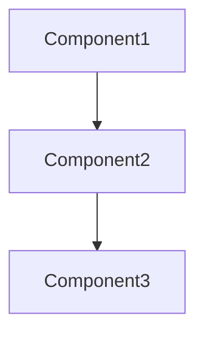

# {Feature Name} - Design Document

## Overview
[Design overview and key technical decisions]

## Architecture

### System Architecture
[Overall system architecture and component relationships]



## Components and Interfaces

### Component 1: [Component Name]
- **Purpose**: [What this component does]
- **Interface**: [API or interface definition]
- **Dependencies**: [What it depends on]

### Component 2: [Component Name]
- **Purpose**: [What this component does]
- **Interface**: [API or interface definition]
- **Dependencies**: [What it depends on]

## Data Models

### Entity 1: [Entity Name]
```typescript
interface Entity1 {
  id: string;
  property1: Type;
  property2: Type;
}
```

### Entity 2: [Entity Name]
```typescript
interface Entity2 {
  id: string;
  property1: Type;
  property2: Type;
}
```

## API Design

### Endpoint 1: [Endpoint Name]
- **Method**: POST/GET/PUT/DELETE
- **Path**: `/api/resource`
- **Request**: [Request structure]
- **Response**: [Response structure]

## Error Handling

### Input Validation
- [How to handle input validation errors]

### System Errors
- [How to handle system errors]

### Business Logic Errors
- [How to handle business logic errors]

## Security Considerations
- [Authentication approach]
- [Authorization approach]
- [Data protection measures]

## Testing Strategy

### Unit Tests
- [What to test and how]

### Integration Tests
- [End-to-end scenarios]

### Performance Tests
- [Performance testing approach]

## Implementation Notes
- [Important implementation considerations]
- [Technology choices and rationale]